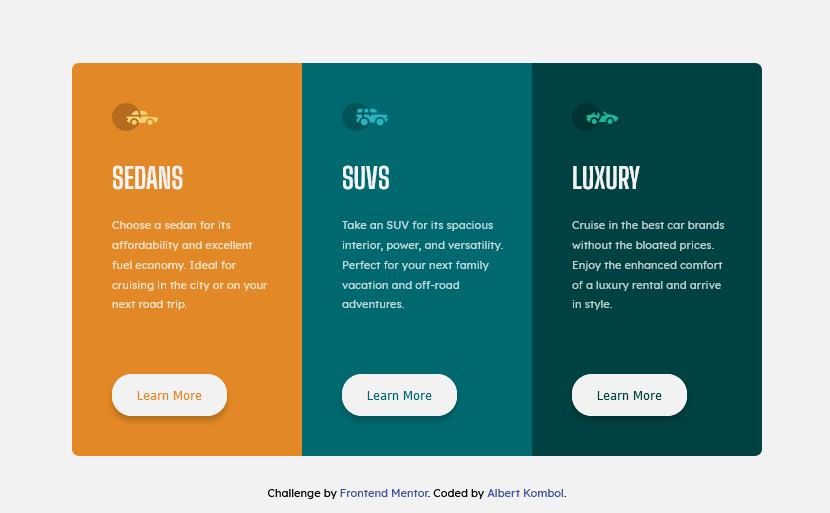

# Frontend Mentor - 3-column preview card component solution

This is a solution to the [3-column preview card component challenge on Frontend Mentor](https://www.frontendmentor.io/challenges/3column-preview-card-component-pH92eAR2-). Frontend Mentor challenges help you improve your coding skills by building realistic projects. 

## Table of contents

- [Overview](#overview)
  - [The challenge](#the-challenge)
  - [Screenshot](#screenshot)
  - [Links](#links)
- [My process](#my-process)
  - [Built with](#built-with)
  - [What I learned](#what-i-learned)
  - [Continued development](#continued-development)
  - [Useful resources](#useful-resources)
- [Author](#author)
- [Acknowledgments](#acknowledgments)

**Note: Delete this note and update the table of contents based on what sections you keep.**

## Overview

### The challenge

Users should be able to:

- View the optimal layout depending on their device's screen size
- See hover states for interactive elements

### Screenshot



### Links

- Solution URL: [https://github.com/kalush89/3-column-preview-card-component-main](https://github.com/kalush89/3-column-preview-card-component-main)
- Live Site URL: [https://3-column-preview-card-component-main-blond.vercel.app/](https://3-column-preview-card-component-main-blond.vercel.app/)

## My process

### Built with

- Semantic HTML5 markup
- CSS custom properties
- Flexbox
- Mobile-first workflow

### What I learned

Use this section to recap over some of your major learnings while working through this project. Writing these out and providing code samples of areas you want to highlight is a great way to reinforce your own knowledge.

To see how you can add code snippets, see below:

```html
<h1>Some HTML code I'm proud of</h1>
```
```css
.proud-of-this-css {
  color: papayawhip;
}
```
```js
const proudOfThisFunc = () => {
  console.log('🎉')
}
```

### Continued development

Wish to focus on the following concepts in the future

- Flexbox
- CSS custom properties
- Mobile-first workflow

### Useful resources

- [Centering things](https://www.better.dev/centering-things-with-css-flexbox) - This helped me center the proect on the page. I really liked this solution and will use it going forward.
- [Learn CSS Flexbox](https://www.freecodecamp.org/news/learn-css-flexbox/) - This is an amazing article which helped me finally understand Fexbox layouts. I'd recommend it to anyone still learning this concept.
## Author

- Frontend Mentor - [@kalush89](https://www.frontendmentor.io/profile/kalush89)

## Acknowledgments

Big thanks to the Frontend Mentor team for the oppotunity to learn Front-end development wth such ease. This is the perfect place to be for anyone that aspires to become proficient in the required Front-end tools.